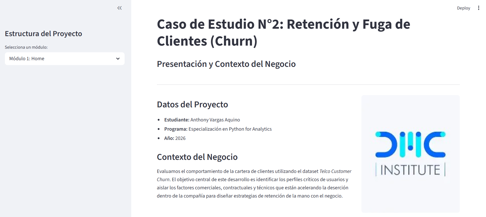
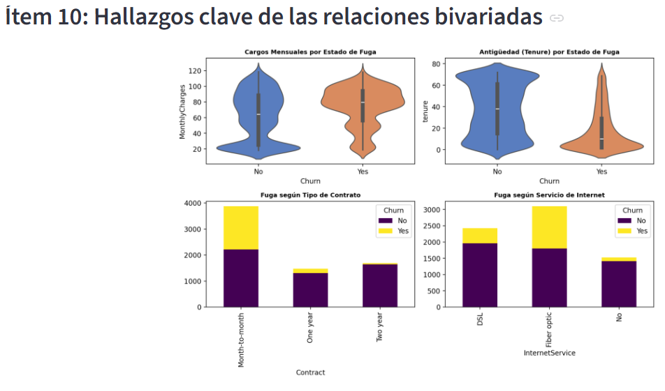

# Caso de Estudio N°2: Retención y Fuga de Clientes (Churn)

## Descripción del Proyecto
En este proyecto desarrollé una aplicación web interactiva utilizando Streamlit para analizar a fondo el comportamiento de la cartera de usuarios de la compañía, tomando como base el dataset Telco Customer Churn. El objetivo central de este trabajo fue aislar de manera clara los factores comerciales, contractuales y técnicos que disparan la deserción de los clientes. Mediante un Análisis Exploratorio de Datos (EDA), el panel desglosa las estadísticas descriptivas de las variables, el control de valores nulos, las distribuciones cuantitativas y cualitativas, y las relaciones bivariadas esenciales. El enfoque es estrictamente analítico y orientado a la toma de decisiones del negocio, sin implementar modelos predictivos de machine learning.

## Capturas de la app
*Visualización de las pantallas principales de la aplicación analítica:*

* **Módulo Principal de Análisis (EDA):**
  

* **Sección de Cruces y Hallazgos Clave:**
  

## Instrucciones de ejecución
Para correr esta aplicación analítica en tu entorno local, sigue esta secuencia de pasos:

1. **Descargar o clonar los archivos del repositorio:**
    Abre tu terminal y ejecuta:
    
    git clone https://github.com/anthonyvargas-data/telco-customer-churn-eda.git
    cd telco-customer-churn-eda

2. **Instalar las dependencias del sistema:**
    Asegúrate de contar con Python instalado en tu equipo y ejecuta el siguiente comando en la terminal para desplegar las librerías requeridas (pandas, streamlit, matplotlib y seaborn):
    
    pip install -r requirements.txt

3. **Lanzar el servidor de Streamlit:**
    Inicializa la aplicación ejecutando en la consola:
    
    streamlit run app.py

    *La aplicación web se desplegará de forma automática en tu navegador predeterminado bajo la dirección local http://localhost:8501.*

## Links relevantes
* **Dataset Empleado:** [Telco Customer Churn en Kaggle](https://www.kaggle.com/datasets/blastchar/telco-customer-churn)
* **Acceso a la Aplicación Activa:** [Link de la App en Streamlit Community Cloud](https://telco-customer-churn-eda-anthonyvargas-data.streamlit.app/) 
